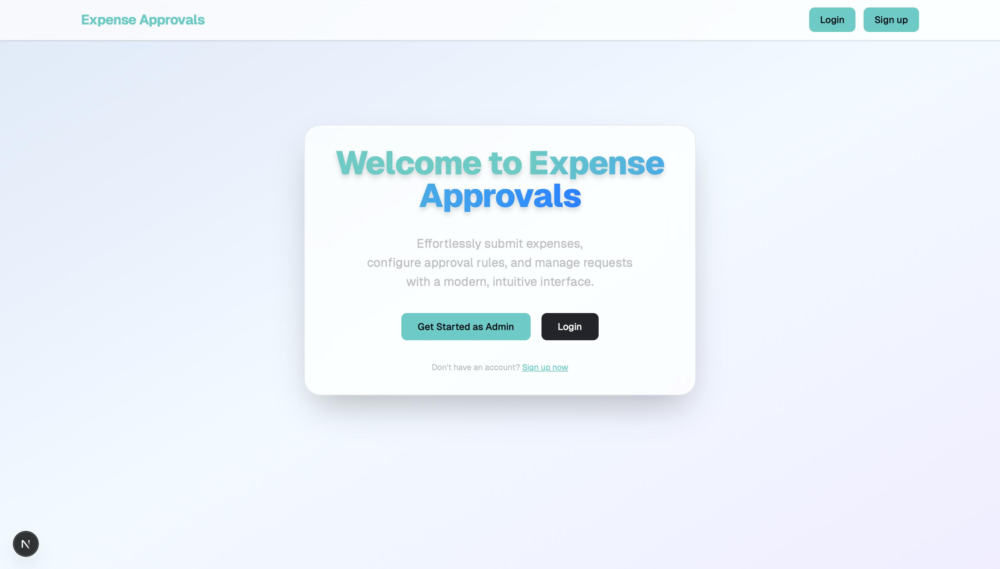
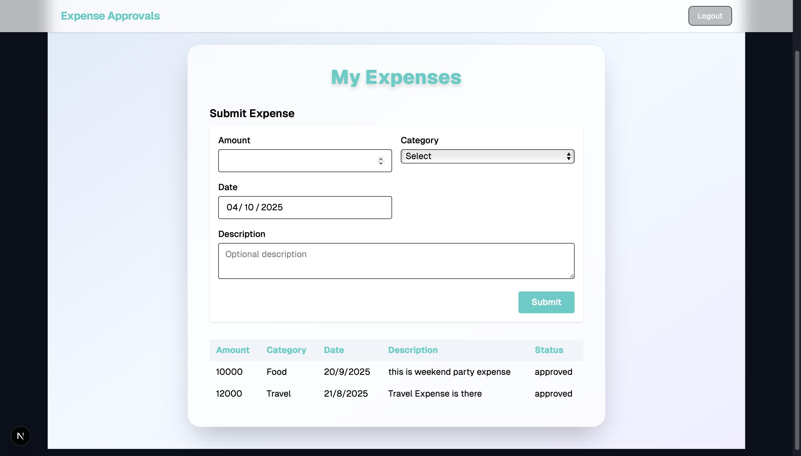
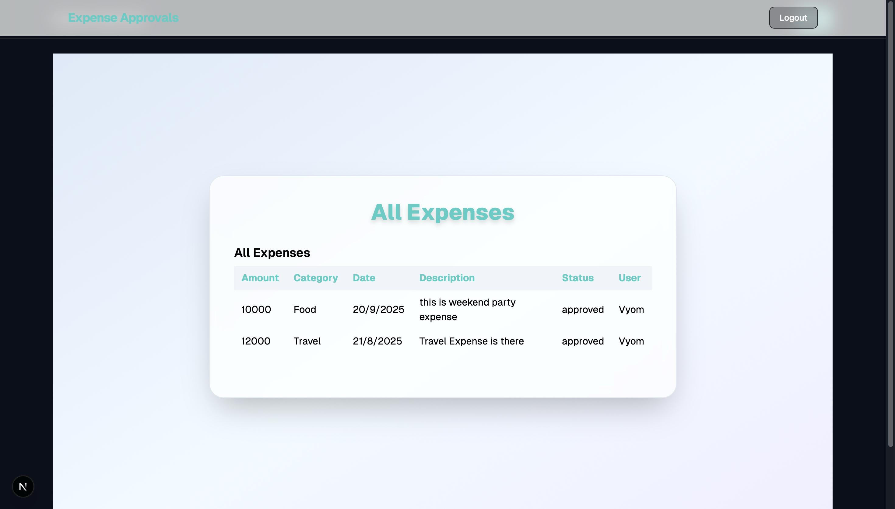
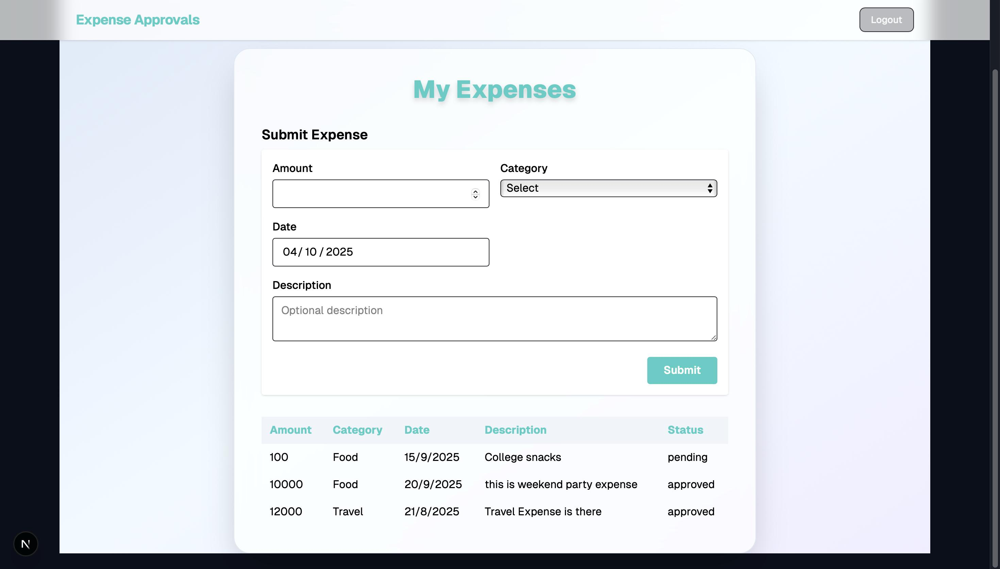
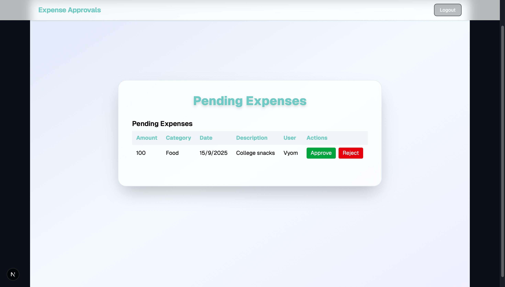

# TeamChampions Odoo Hackathon Repository

Welcome to the TeamChampions Odoo Hackathon project!  
This repository contains the source code for our hackathon submission, focused on delivering a robust web experience with Odoo integrations.

## 🚀 Overview

TeamChampions is a web platform built primarily with **TypeScript**, alongside **CSS** for styling and some **JavaScript** utilities.  
It is designed to showcase our hackathon solution, featuring a clean UI and seamless user experience.

## 🖥️ Screenshots

Below are some images of the website to give you a preview of its design and functionality:







> Please ensure your images are named `screenshot1.png` to `screenshot5.png` and placed in an `images/` directory in the repository root.

## 🧑‍💻 Technologies Used

- **TypeScript** (96.7%): Main language for logic and components
- **CSS** (3.2%): Styling for UI/UX
- **JavaScript** (0.1%): Additional scripting

## 📦 Installation

1. **Clone the repository**
   ```bash
   git clone https://github.com/Rahul-Morabiya/TeamChampions_Odoo_Hackathon_Repository.git
   ```
2. **Install dependencies**
   ```bash
   npm install
   ```
3. **Run the development server**
   ```bash
   npm start
   ```
4. Visit `http://localhost:3000` in your browser for frontend.
5. Visit `http://localhost:3001` for backend.

## 📝 Usage

- Browse through the platform to explore its features.
- Refer to the screenshots above for guidance on the UI.

## 🤝 Contributing

We welcome contributions! Please fork the repository and submit a pull request.

## 📄 License

This project is licensed under the [MIT License](LICENSE).

## 🙌 Acknowledgments

Thanks to all participants of the Odoo Hackathon and the TeamChampions members for their hard work!

---

For any questions or support, feel free to open an issue on this repository.
